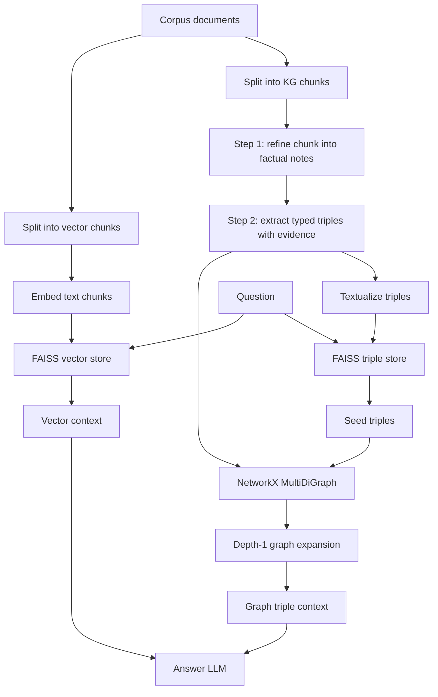
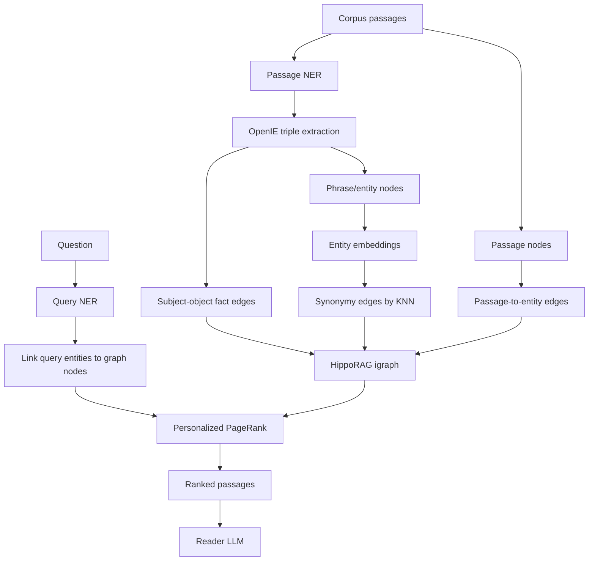
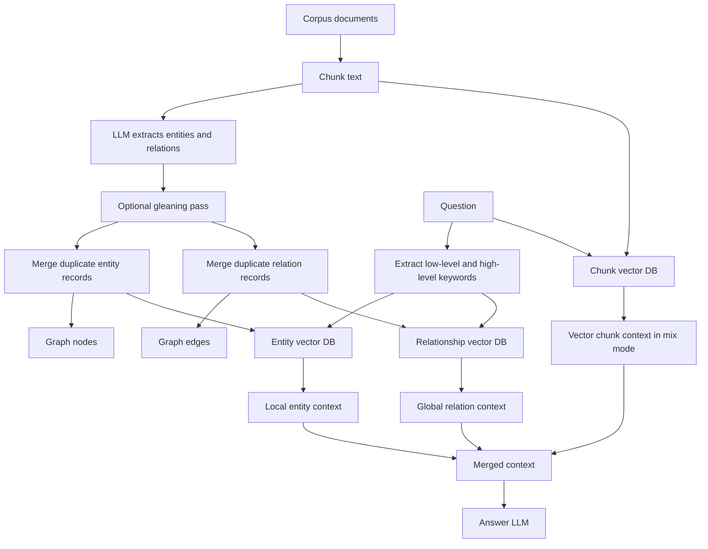

# KG and Graph Creation Approaches in HybridRAG, HippoRAG, and LightRAG

This note summarizes how the three graph-based RAG approaches create and use
knowledge graphs, then cross-checks those ideas against the code and artifacts in
this repository.

Sources used:

- HybridRAG paper: `data/2408.04948v1.pdf`, arXiv `2408.04948`
- HippoRAG paper: `docs/papers/2405.14831.pdf`, arXiv `2405.14831`
- LightRAG paper: `docs/papers/2410.05779.pdf`, arXiv `2410.05779`
- Local implementation and run artifacts under `HybridRAG/`, `HippoRAG/`, and `lightRAG/`

Important caveat: the word "triple" is not identical across all three systems.
HybridRAG stores typed extracted KG triples. HippoRAG stores OpenIE triples, then
adds passage and synonym edges to build a larger retrieval graph. LightRAG stores
entity and relation records, where relation records are comparable to graph
triples but include descriptions and high-level keywords rather than a strict
subject-predicate-object schema.

## Dataset and Graph Summary

| Dataset | Corpus docs | QA items |
|---|---:|---:|
| ConditionalQA | 59 | 285 |
| HotPotQA stratified | 999 | 500 |

| Dataset | Approach | Full graph model | Nodes | Edges | Triples / relations |
|---|---|---|---:|---:|---:|
| ConditionalQA | HybridRAG | `gpt-4o-2024-08-06` | 5,139 | 3,750 | 3,750 |
| ConditionalQA | LightRAG | `gpt-4o-2024-08-06` | 2,328 | 2,530 | 2,530 |
| ConditionalQA | LightRAG | `mistralai/Mistral-7B-Instruct-v0.3` | 1,876 | 1,461 | 1,461 |
| ConditionalQA | LightRAG | `mistralai/Mixtral-8x7B-Instruct-v0.1` | 1,069 | 666 | 666 |
| ConditionalQA | HippoRAG | `gpt-4o-2024-08-06` | 1,754 | 5,336 | 1,528 |
| ConditionalQA | HippoRAG | `gpt-3.5-turbo-0125` | 1,731 | 5,014 | 1,434 |
| ConditionalQA | HippoRAG | `mistralai/Mistral-7B-Instruct-v0.3` | 2,696 | 8,716 | 2,640 |
| ConditionalQA | HippoRAG | `mistralai/Mixtral-8x7B-Instruct-v0.1` | 2,337 | 7,726 | 2,310 |
| HotPotQA | HybridRAG | `Qwen/Qwen3.6-35B-A3B` served as `qwen-kg` | 9,870 | 10,649 | 10,649 |
| HotPotQA | LightRAG | `Qwen3.6-27B` | 7,536 | 8,652 | 8,652 |
| HotPotQA | HippoRAG | `Qwen3.6-27B` | 10,023 | 38,086 | 12,004 |

Artifacts used for these counts:

- HybridRAG ConditionalQA: `HybridRAG/indexes/conditionalqa/dev-gpt-4o-2024-08-06-shared/`
- HybridRAG HotPotQA: `HybridRAG/indexes/hotpotqa/stratified-qwen-shared/`
- LightRAG ConditionalQA: `lightRAG/workspaces/conditionalqa-gpt4o20240806/`, `lightRAG/workspaces/conditionalqa-mistral7b-isolated/`, `lightRAG/workspaces/conditionalqa-mixtral8x7b-isolated/`
- LightRAG HotPotQA: `lightRAG/adapter_runs/hotpotqa/index-qwen36-27b/`
- HippoRAG ConditionalQA: full and `full-fixed` runs under `HippoRAG/adapter_runs/conditionalqa/`
- HippoRAG HotPotQA: `HippoRAG/adapter_runs/hotpotqa/index-qwen36-27b/`

Partial or smoke indexes were excluded from the main table.

## 1. HybridRAG

### Paper Idea

The HybridRAG paper proposes combining two context sources:

- VectorRAG context: semantically similar chunks retrieved from a vector DB.
- GraphRAG context: entity-relation facts retrieved from a knowledge graph.

The paper's core claim is that vector retrieval and graph retrieval fail in
different ways. Vector retrieval gives broad semantic context but may miss
precise entity relationships. Graph retrieval gives structured relationships but
may fail when the question does not explicitly mention a graph entity. HybridRAG
therefore concatenates both contexts before answer generation.

For KG construction, the paper describes:

- PDF/document loading.
- Chunking with `RecursiveCharacterTextSplitter`.
- KG chunk size of 2024 characters and overlap of 204 characters.
- A two-tier LLM chain for content refinement and information extraction.
- Extraction of triplets shaped like `[h, type, r, o, type, metadata]`.
- Entity disambiguation and concise entity representations.
- Aggregation of chunk-level triplets into a document-level KG.
- Storage of extracted triplets for later graph construction.
- Graph traversal with depth 1 for graph QA.

### Our Implementation

Our implementation follows the paper closely but uses local components suited to
our experiments:

- Embeddings: `OpenAIEmbeddings(model="text-embedding-3-small")`
- Vector store: FAISS over text chunks.
- Triple store: FAISS over textualized triples.
- Graph store: `networkx.MultiDiGraph`.
- KG generation: two structured LLM calls with Pydantic validation.
- QA: vector context plus graph triple context.

The KG build code is mainly in:

- `HybridRAG/hybridrag/indexing.py`
- `HybridRAG/hybridrag/prompts.py`
- `HybridRAG/hybridrag/schemas.py`
- `HybridRAG/hybridrag/retrieval.py`

The two KG creation steps are:

1. Refine the raw chunk into faithful factual notes.
   - Pydantic class: `RefinedChunk`
   - Fields: `summary`, `key_facts`, `exact_evidence_snippets`, `entities`, `section_path`

2. Extract validated triples from the refined notes.
   - Pydantic class: `KGExtractionResult`
   - Each `KGTriple` has `head`, `head_type`, `relation`, `tail`, `tail_type`, `evidence`, `metadata`

The graph itself stores normalized head and tail strings as nodes. Each edge is a
KG triple with relation, evidence, metadata, and `triple_id`.

### Flow



### Exact Examples From Our Runs

ConditionalQA examples from
`HybridRAG/indexes/conditionalqa/dev-gpt-4o-2024-08-06-shared/triples.jsonl`:

| Head | Head type | Relation | Tail | Tail type | Evidence |
|---|---|---|---|---|---|
| `exam or qualification results` | `other` | `can be challenged if` | `you think it’s wrong` | `condition` | `<p>You can challenge the results of an exam or qualification if you think it’s wrong.</p>` |
| `GCSEs, AS levels or A levels` | `other` | `can request review through` | `school or college` | `person_group` | `<p>You can ask your school or college to get an exam result looked at again - this is called requesting a review.</p>` |
| `private student` | `person_group` | `can appeal directly to` | `awarding organisation` | `other` | `<p>You can appeal directly to the awarding organisation if you’re a private student, for example, if you are home schooled or are a mature student.</p>` |

HotPotQA examples from
`HybridRAG/indexes/hotpotqa/stratified-qwen-shared/triples.jsonl`:

| Head | Head type | Relation | Tail | Tail type | Evidence |
|---|---|---|---|---|---|
| `Steven Williams` | `person` | `is also known as` | `"Dr. Death" Steve Williams` | `other` | `Steven Williams (May 14, 1960 - December 29, 2009), better known by his ring name "Dr. Death" Steve Williams` |
| `Steven Williams` | `person` | `date of birth` | `May 14, 1960` | `date` | `Steven Williams (May 14, 1960 - December 29, 2009)` |
| `Steven Williams` | `person` | `occupation` | `professional wrestler` | `occupation` | `was an American professional wrestler` |

### What This Means Practically

HybridRAG creates the most controlled graph among the three approaches. It is
well suited to ConditionalQA because eligibility, prohibitions, exceptions,
amounts, and deadlines can be represented as typed triples with exact evidence.

Example:

```text
(private student:person_group) -[can appeal directly to]-> (awarding organisation:other)
Evidence: You can appeal directly to the awarding organisation if you’re a private student...
```

This is easy to format into a QA prompt and easy to audit when answers are wrong.

Its main trade-off is extraction cost. It needs two LLM passes per KG chunk and
strict structured output handling.

## 2. HippoRAG

### Paper Idea

HippoRAG is inspired by the hippocampal indexing theory of human memory. The
paper maps the biological analogy onto retrieval:

- LLM as "neocortex": processes passages and extracts salient concepts.
- Retrieval encoder as "parahippocampal regions": links similar phrases.
- KG plus Personalized PageRank as "hippocampus": stores associations and
  completes partial cues during retrieval.

The key distinction from ordinary graph RAG is that HippoRAG is primarily a
retrieval graph. It is not just a set of triples shown to the LLM. It builds a
larger graph with:

- Phrase/entity nodes from OpenIE.
- OpenIE subject-object edges.
- Passage nodes.
- Passage-to-phrase edges.
- Synonymy edges between similar phrase nodes.

At query time, the system extracts named entities from the query, maps them to
graph nodes, runs Personalized PageRank, and ranks passages by the PPR mass that
lands on passage nodes.

### Paper KG Creation Details

The paper's offline indexing process:

1. For each passage, run one-shot NER.
2. Feed the passage plus named-entity list into an OpenIE prompt.
3. Extract RDF-style triples.
4. Add noun phrase nodes and relation edges to the KG.
5. Use a retrieval encoder to add synonymy edges when cosine similarity exceeds a
   threshold.
6. Maintain a node-passage matrix `P`, where each entry counts how often a noun
   phrase appears in a passage.

The paper's online retrieval process:

1. Extract query named entities.
2. Encode query entities.
3. Link them to nearest graph nodes.
4. Use those graph nodes as the PPR reset distribution.
5. Run PPR over triple and synonymy edges.
6. Aggregate node probabilities back to passages.

### Our Implementation

The relevant code is in:

- `HippoRAG/src/hipporag/prompts/templates/ner.py`
- `HippoRAG/src/hipporag/prompts/templates/triple_extraction.py`
- `HippoRAG/src/hipporag/information_extraction/openie_openai.py`
- `HippoRAG/src/hipporag/information_extraction/openie_vllm_offline.py`
- `HippoRAG/src/hipporag/HippoRAG.py`

The local prompts match the paper's two-step OpenIE design:

- NER prompt returns `{"named_entities": [...]}`.
- Triple extraction prompt returns `{"triples": [[subject, predicate, object], ...]}`.

Graph construction in our code:

- `add_fact_edges`: adds bidirectional edges between subject and object entities
  from extracted triples.
- `add_passage_edges`: connects passage chunk nodes to phrase/entity nodes.
- `add_synonymy_edges`: embeds entity nodes, runs KNN, and adds similarity edges
  above the configured threshold.
- `run_ppr`: runs igraph Personalized PageRank with graph weights and returns
  passage-node scores.

### Flow



### Exact Examples From Our Runs

ConditionalQA examples from
`HippoRAG/adapter_runs/conditionalqa/openai/gpt-4o-2024-08-06/full/openie_results_ner_gpt-4o-2024-08-06.json`:

Extracted entities:

```text
GCSEs, AS levels, A levels, Ofqual, BTEC, NVQ, Wales, Scotland
```

OpenIE triples:

| Subject | Predicate | Object |
|---|---|---|
| `You` | `can challenge` | `exam or qualification results` |
| `You` | `can request review from` | `school or college` |
| `Requesting a review` | `applies to` | `GCSEs` |
| `Requesting a review` | `applies to` | `AS levels` |
| `Requesting a review` | `applies to` | `A levels` |

HotPotQA examples from
`HippoRAG/adapter_runs/hotpotqa/index-qwen36-27b/openie_results_ner_Qwen3.6-27B.json`:

Extracted entities:

```text
Dr. Death, Steve Williams, Steven Williams, May 14, 1960, December 29, 2009, American, University of Oklahoma
```

OpenIE triples:

| Subject | Predicate | Object |
|---|---|---|
| `Steve Williams` | `also known as` | `Dr. Death` |
| `Steve Williams` | `birth name` | `Steven Williams` |
| `Steve Williams` | `born on` | `May 14, 1960` |
| `Steve Williams` | `died on` | `December 29, 2009` |
| `Steve Williams` | `nationality` | `American` |

Another HotPotQA example:

| Subject | Predicate | Object |
|---|---|---|
| `10 Years` | `is` | `American alternative metal band` |
| `10 Years` | `formed in` | `Knoxville` |
| `Knoxville` | `located in` | `Tennessee` |
| `10 Years` | `formed in` | `1999` |
| `10 Years` | `has member` | `Jesse Hasek` |

### What This Means Practically

HippoRAG is best understood as a multi-hop retrieval engine rather than a clean
answer-context graph. The OpenIE triples are only the starting point. The final
retrieval graph is larger because it includes passage nodes and synonym edges.

That explains our HotPotQA count:

- OpenIE triples: 12,004
- Final graph edges: 38,086

The edge count is larger because HippoRAG adds graph structure beyond extracted
triples.

This is useful for entity-bridge questions like:

```text
10 Years -> Knoxville -> Tennessee
```

Instead of hoping a vector retriever finds the right chunk directly, PPR can
spread probability through the graph neighborhood and rank passages connected to
both concepts.

The main risk is extraction/linking quality. If NER misses a query concept or
OpenIE misses a critical fact, PPR starts from weak seeds.

## 3. LightRAG

### Paper Idea

LightRAG builds a graph-augmented retrieval system optimized for speed,
incremental updates, and dual-level retrieval.

The paper's graph creation process has three core steps:

1. `Recog`: extract entities and relationships from chunks.
2. `Prof`: profile each entity and relation into key-value retrieval records.
3. `Dedupe`: merge repeated entities and relations across chunks.

The paper emphasizes that graph data should support both:

- Low-level retrieval: precise entities and their relationships.
- High-level retrieval: broader themes and relation-level concepts.

At query time, LightRAG extracts two keyword sets:

- Low-level keywords for entity search.
- High-level keywords for relation/theme search.

It then retrieves graph records through vector matching and gathers neighboring
nodes/chunks to form the final context.

### Our Implementation

The relevant code is in:

- `lightRAG/lightrag/prompt.py`
- `lightRAG/lightrag/operate.py`
- `lightRAG/lightrag/base.py`

Our local LightRAG extraction prompt outputs lines like:

```text
entity<|#|>entity_name<|#|>entity_type<|#|>entity_description
relation<|#|>source_entity<|#|>target_entity<|#|>relationship_keywords<|#|>relationship_description
```

Important implementation details:

- `extract_entities` runs extraction per chunk.
- It can run a "gleaning" continuation pass to recover missed entities or
  relationships.
- `_merge_nodes_then_upsert` merges entity descriptions, source chunk IDs, file
  paths, and entity types, then upserts to graph and entity vector DB.
- `_merge_edges_then_upsert` merges relation descriptions, keywords, source IDs,
  and weights, then upserts to graph and relationship vector DB.
- `QueryParam.mode` controls retrieval:
  - `local`: entity-focused retrieval.
  - `global`: relationship/theme-focused retrieval.
  - `hybrid`: local plus global KG retrieval.
  - `mix`: KG retrieval plus vector chunk retrieval.
- `extract_keywords_only` gets high-level and low-level keywords from the query.
- `_perform_kg_search` retrieves entities from `entities_vdb`, relations from
  `relationships_vdb`, and vector chunks in `mix` mode.
- `_merge_all_chunks` merges vector chunks, entity-related chunks, and
  relation-related chunks with deduplication.

### Flow



### Exact Examples From Our Runs

ConditionalQA examples from
`lightRAG/workspaces/conditionalqa-gpt4o20240806/vdb_relationships.json`:

| Source entity | Target entity | Relationship content |
|---|---|---|
| `Requesting A Review` | `School Or College` | `process administration,review request` / `Schools or colleges are requested to conduct reviews of exam results.` |
| `Private Student` | `Requesting A Review` | `direct request,private candidacy` / `Private students can request a review of their exam results directly themselves.` |
| `Appeal` | `School Or College` | `appeal initiation,process administration` / `Schools or colleges can make appeals to Ofqual if a review outcome is unsatisfactory.` |
| `Exams Officer` | `Internal Appeals Procedure` | `information provision,procedure management` / `Exams officers provide information and manage internal appeals procedures for reviews.` |

HotPotQA examples from
`lightRAG/adapter_runs/hotpotqa/index-qwen36-27b/vdb_relationships.json`:

| Source entity | Target entity | Relationship content |
|---|---|---|
| `10 Years` | `Knoxville` | `formation location` / `10 Years was formed in Knoxville.` |
| `10 Years` | `Tennessee` | `formation location` / `10 Years was formed in Tennessee.` |
| `Knoxville` | `Tennessee` | `geographical location` / `Knoxville is located in the state of Tennessee.` |
| `10 Years` | `Brian Vodinh` | `membership,role` / `Brian Vodinh is a member of 10 Years and plays drums, guitar, and provides backing vocals.` |
| `10 Years` | `Chad Huff` | `membership,role` / `Chad Huff is a member of 10 Years and plays bass guitar.` |

### What This Means Practically

LightRAG's graph is less strict than HybridRAG's graph and less PPR-driven than
HippoRAG's graph. It stores rich entity and relationship summaries that are
directly useful as context.

Example relationship record:

```text
src_id: 10 Years
tgt_id: Knoxville
keywords: formation location
description: 10 Years was formed in Knoxville.
```

This format is retrieval-friendly because the keyword phrase `formation location`
and the description both live in the relationship vector DB. The graph gives the
system a way to pull related entities and chunks after keyword matching.

The main strength is efficient graph/vector retrieval and incremental updates.
The main risk is that relationship descriptions are not as schema-controlled as
HybridRAG triples, so answer formatting for strict benchmarks may require more
care.

## Comparison

### Graph Construction Unit

| Approach | Main graph unit | Is relation typed? | Evidence stored? | Adds non-extracted graph edges? |
|---|---|---|---|---|
| HybridRAG | Typed `KGTriple` | Yes: `head_type`, `tail_type`, normalized relation | Yes, exact evidence | No, graph edges are extracted triples |
| HippoRAG | OpenIE triple plus retrieval graph edges | No strict entity type in OpenIE triples | Passage retained in OpenIE file | Yes: passage edges and synonymy edges |
| LightRAG | Entity and relationship records | Entity type exists, relation has keywords and description | Source chunk IDs and file paths | It merges duplicate graph records and retrieves neighbors |

### Retrieval Behavior

| Approach | Retrieval strategy | What reaches the answer LLM |
|---|---|---|
| HybridRAG | Vector chunk retrieval plus triple retrieval plus graph expansion | Text chunks and formatted graph triples with evidence |
| HippoRAG | Fact/entity linking plus PPR over graph, then passage ranking | Ranked passages, optionally filtered facts depending on run path |
| LightRAG | Low-level entity keyword retrieval plus high-level relationship keyword retrieval; `mix` also adds vector chunks | Entity summaries, relationship summaries, and source chunks |

### Why the Counts Differ

HybridRAG edge count equals triple count because every graph edge is one saved
KG triple.

LightRAG edge count equals relationship-record count in the saved vector DB or
GraphML. These are entity-to-entity relationship summaries, not strict typed
triples.

HippoRAG edge count is much larger than OpenIE triple count because the final
graph includes:

- extracted triple edges,
- passage-to-entity edges,
- synonymy edges between similar entity/phrase nodes,
- often bidirectional subject-object graph connections.

### Best Fit for Our Datasets

ConditionalQA has many rule, condition, eligibility, exception, yes/no, and
conditional-span questions. HybridRAG is the most naturally aligned because its
schema can explicitly type conditions, requirements, exceptions, amounts,
deadlines, and evidence snippets.

HotPotQA has many bridge and comparison questions. HippoRAG and LightRAG are
well matched to entity-centric bridge retrieval because both build connections
between named entities. HybridRAG also works well here because the extracted
triples are clean and auditable, especially when graph triple context is combined
with vector context.

### Simple Mental Model

```text
HybridRAG = "Make clean typed triples, retrieve vector chunks and triples, answer with both."

HippoRAG = "Make an associative memory graph, run PPR from query concepts, retrieve passages."

LightRAG = "Make entity/relation summaries, retrieve by low/high-level keywords, merge KG and chunks."
```

### Implementation Trade-Offs We Observed

| Dimension | HybridRAG | HippoRAG | LightRAG |
|---|---|---|---|
| Structure control | Highest | Medium | Medium |
| Graph retrieval style | Seed triples plus local expansion | PPR over associative graph | Keyword/vector match over entity and relation stores |
| Evidence auditability | Strong | Medium, passage-level | Medium, source chunk-level |
| Multi-hop behavior | Local graph expansion plus vector context | Strong PPR-based graph propagation | Neighbor and relation retrieval, no PPR |
| Conditional/rule QA fit | Strong | Moderate | Moderate |
| Incremental update emphasis | Not primary in our implementation | Possible but not main paper emphasis | Core design goal |
| Main failure mode | Bad or missing structured triple | NER/OpenIE/linking misses query concept | Vague relation summaries or keyword extraction miss |

## References

- HybridRAG: Integrating Knowledge Graphs and Vector Retrieval Augmented Generation for Efficient Information Extraction. arXiv:2408.04948. https://arxiv.org/abs/2408.04948
- HippoRAG: Neurobiologically Inspired Long-Term Memory for Large Language Models. arXiv:2405.14831. https://arxiv.org/abs/2405.14831
- LightRAG: Simple and Fast Retrieval-Augmented Generation. arXiv:2410.05779. https://arxiv.org/abs/2410.05779
